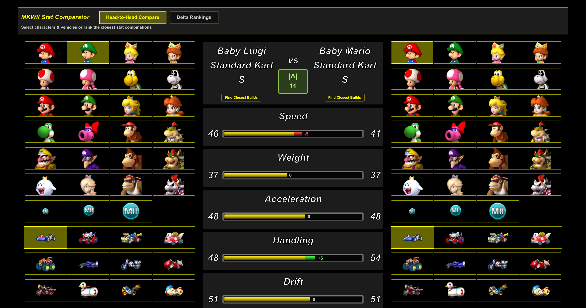
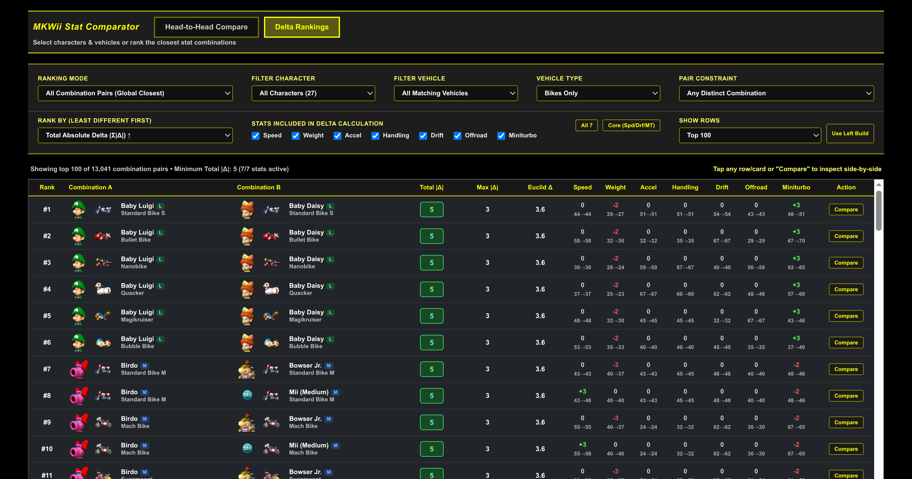
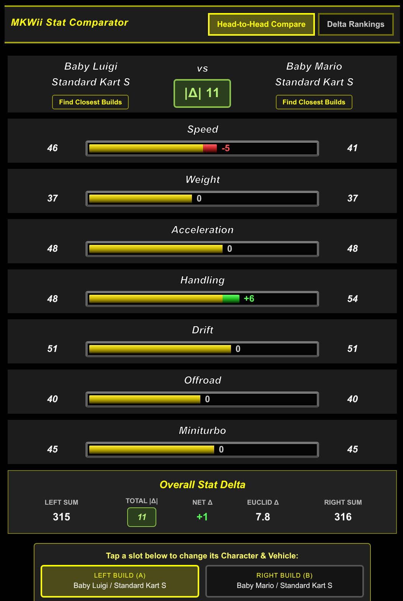
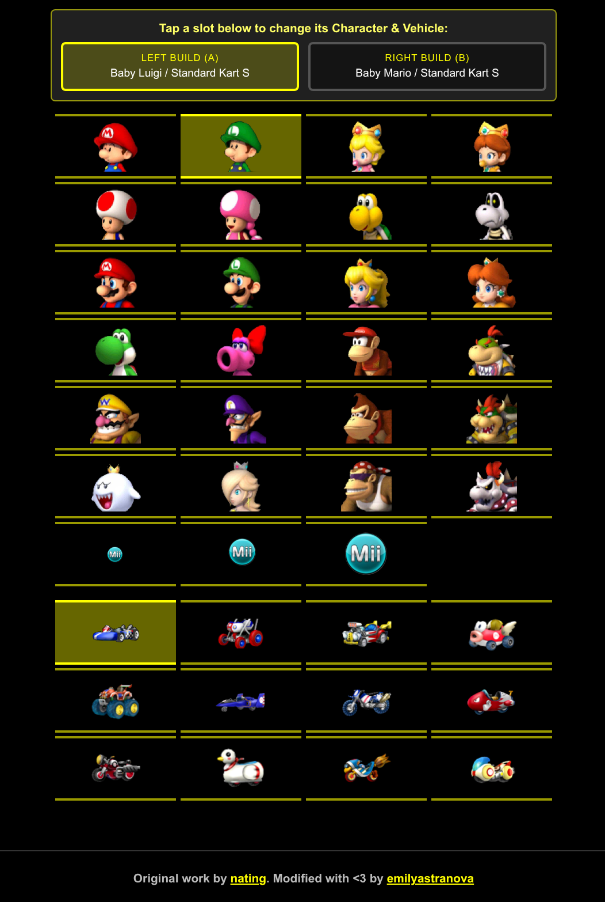

# mkwii-kart-stats

Compare statistics of character/vehicle combinations for Mario Kart Wii.

Original work by [nating](https://github.com/nating) ([nating.io/mkwii-kart-stats](https://nating.io/mkwii-kart-stats/)). Modified with &lt;3 by [emilyastranova](https://github.com/emilyastranova).

## Screenshots

### Desktop

  

  

### Mobile Views

  
  

## Overview

Contrary to popular belief, not all Mario Kart Wii characters in the same weight class have the same stats. This interface gives players the edge by understanding the exact numbers that define the differences between all 324 valid character-vehicle combinations.

## Fork Improvements

1. **Delta Rankings Tab (Least Different Stat Combinations)**
   - Adds a dedicated **Delta Rankings** view that evaluates and ranks character/bike/kart combinations from **least different stats at the top** to most different.
   - **Dual Ranking Modes**:
     - **All Combination Pairs (Global Closest)**: Finds the closest stat twins across the entire roster.
     - **Closest to Target Combination**: Ranks all builds by their proximity to any chosen Character + Vehicle (or via one-click **Find Closest Builds** shortcuts in the Head-to-Head tab).
   - **Rich Filtering & Custom Metrics**: Filter by **Bikes Only**, **Karts Only**, or **All Vehicles**; enforce pair constraints (*Different Vehicles Only*, *Different Characters*, *Different Weight Classes*); rank by **Total Absolute Delta ($\sum |\Delta|$)**, **Euclidean Distance ($\sqrt{\sum \Delta^2}$)**, or **Max Single-Stat Delta ($\max |\Delta|$)**; and toggle which of the 7 stats (`Speed`, `Weight`, `Acceleration`, `Handling`, `Drift`, `Offroad`, `Miniturbo`) are included in the delta calculation.
   - **One-Click Compare**: Clicking any ranked pair immediately loads both builds into the Head-to-Head view.

2. **Overall Stat Delta Summary in Head-to-Head View**
   - Displays a live color-coded **`|Δ|`** badge directly beneath `vs` in the comparison header.
   - Includes an **Overall Stat Delta** card below `Miniturbo` summarizing **Left Sum**, **Right Sum**, **Total $|\Delta|$**, **Net $\Delta$**, and **Euclidean $\Delta$**.

3. **Authentic In-Game Visuals & Desktop UX Enhancements**
   - Styled the stat bars after Mario Kart Wii's in-game UI with a bottom-shaded yellow/green/red vertical gradient, beveled grey box outline, and inner black outline gap.
   - Added mouse hover highlights over character and vehicle tiles.

4. **Mobile-Friendly Responsive Design**
   - Preserves the classic 3-column layout on desktop while redesigning the mobile workflow:
     - Places the **Head-to-Head stats panel at the top** on mobile with an interactive **Left Build (A) / Right Build (B) Switcher** so you can swap characters and vehicles without scrolling across stacked grids.
     - Replaces the 14-column desktop rankings table on mobile with compact, zero-horizontal-scroll **Mobile Delta Cards** and collapsible filter controls.
     - Eliminates horizontal viewport overflow/play on mobile screens.

